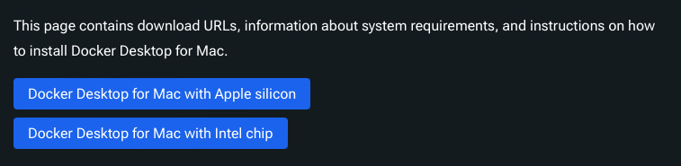
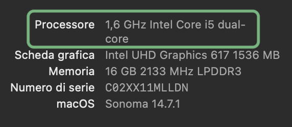
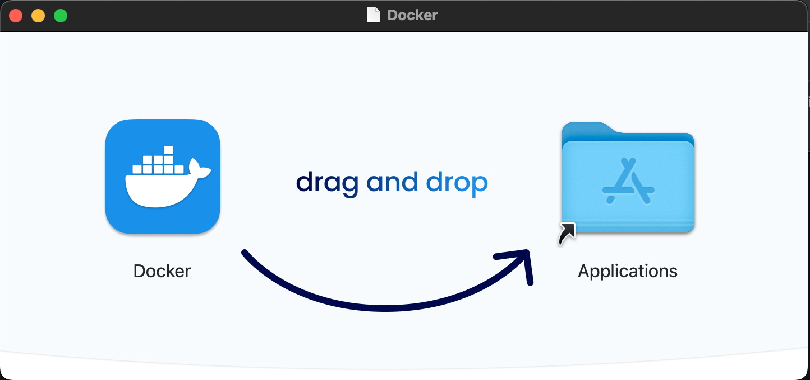
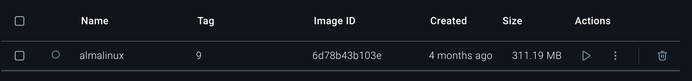
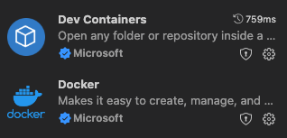
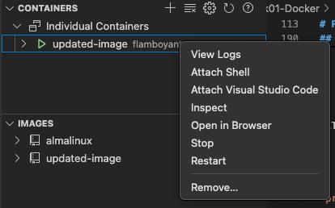

# Run Almalinux9 with Docker on MAC
The following guide was written for a macOS <ins>Sonoma 14.7.1</ins> with <ins>Intel Core i5 dual-core</ins>.

## Install Docker on macOS 

1. Go to https://docs.docker.com/desktop/setup/install/mac-install/.

2. Identify the **Docker Desktop** version that matches the type of **Chip** on your computer. 

    
    
    In order to find out if your MAC has <ins>Apple Silicon</ins> or <ins>Intel Chip</ins>:

    - Click the **Apple**  icon in the top-left corner of your screen.
    - Select **About this Mac**.
    - Read which type of **Chip** is used on your computer.

        <p align="center">
            
        </p>
3. Once identified, download the proper `Docker.dmg` file. 

4. Go to **Finder>Download** and double click on the `Docker.dmg` file, then drag and drop the **Docker** icon into the **Applications** folder.
    
    <br/>
    <p align="center">
        
    </p>
    <br/>

<br/>

5. Once the installation is ready, the **Docker** app will be available in the **Applications** folder. 


6. Click on the icon to start the application: the **Docker's GUI** will open.


7. If you want, you can verify that your installation worked properly by running the following command on a **Terminal** window:
    ```
    docker --version
    ```

8. By default, **Docker Desktop** will run in the background after closing the GUI's window, but you can always check the applications's status by the menu bar in the top-right corner of your screen.

9. If you want to quit it you can click on **Quit Docker Desktop**; if you want to open the GUI again, you can click on **Go to the Dashboard**.


## Download Almalinux 9 

1. Open a **Terminal** window.

2. Run the following command  on terminal to download the Almalinux 9 image: 
    ```
    docker pull almalinux:9
    ```
    and verify that the output is similar to this:
    
    ```
    9: Pulling from library/almalinux
    e60c9fe2676d: Download complete 
    Digest: sha256:6d78b43b103e7ca90c43a790e73bdd421cec5ae0269b6051ef6836f4070b7476
    Status: Downloaded newer image for almalinux:9
    docker.io/library/almalinux:9
    ```

    From the Docker's GUI, in the Image section, you will see that a new image appeared: 

    

2. Once you have downloaded the image, start  a new container by running:

    ```
    docker run -it almalinux:9 /bin/bash
    ```` 

    This will drop you into a bash shell inside the running container, where you can check that you are using the correct OS by running:
    
    ```
    cat /etc/os-release
    ``` 

    and verify that the output looks like this:

    ```
    NAME="AlmaLinux"
    VERSION="9.5 (Teal Serval)"
    ID="almalinux"
    ID_LIKE="rhel centos fedora"
    VERSION_ID="9.5"
    PLATFORM_ID="platform:el9"
    PRETTY_NAME="AlmaLinux 9.5 (Teal Serval)"
    ANSI_COLOR="0;34"
    LOGO="fedora-logo-icon"
    CPE_NAME="cpe:/o:almalinux:almalinux:9::baseos"
    HOME_URL="https://almalinux.org/"
    DOCUMENTATION_URL="https://wiki.almalinux.org/"
    BUG_REPORT_URL="https://bugs.almalinux.org/"
    ALMALINUX_MANTISBT_PROJECT="AlmaLinux-9"
    ALMALINUX_MANTISBT_PROJECT_VERSION="9.5"
    REDHAT_SUPPORT_PRODUCT="AlmaLinux"
    REDHAT_SUPPORT_PRODUCT_VERSION="9.5"
    SUPPORT_END=2032-06-01
    ```

4. You can exit the container wiht `exit` command.


### Conclusion
You now have Docker installed on your macOS, endowed with a container where Almalinux9 is running.


# Program with C and Julia 

## Open docker container and bash terminal
If you use the `docker run -it almalinux:9 /bin/bash` command from terminal, docker will always start a brand new container, using the same `almalinux:9` image. Therefore, if you want to keep working on the same system, you need to make sure that you are always using the same container.

The easiest way to do it is from the Docker's GUI:

1. Open **Docker Desktop** and **Start** your container by pressing the play button ▶️.
2. Once the container is running, you can move to the **Exec** page to use the bash within the Docker's GUI. 
3. From here, you can also open the same window in an external terminal if you find it more convenient.

Nonetheless, some information is still reset when a container is stopped and restarded. Therefore, you will need to save the state of your container into an updated image. In this way, the next time you will have to work in your environment, you will be able to run the container on the last up to date image.

1. Run a container with the `almalinux` image.
    ```
    docker run -it almalinux /bin/bash
    ```

2. Work in the container and modify the environment according to what you need.

3. When you're done, stop the container.

4. Generate a new image `uppdated_image` starting from the current status of the container you just used:
    ```
    docker commit container_name updated_image
    ```

5. The next time you'll have to work on it, you can run a new container starting from the previously saved image:
    ```
    docker run -it updated_image /bin/bash
    ```

## Compiled language - C
In order to program with C in this environment, you can follow these steps:

1. Install `gcc` cmpiler by running the commands:
    ```
    dnf update
    dnf install gcc
    ```
    If you want, you can check for the presence of `gcc` by running with this command:

    ```
    dnf group info "Developement Tools"
    ```
    as it should be put inside the "Mandatory Packages".


2. Create a directory where you will put all your C codes and place yourself in there:
    ```
    mkdir compiled
    cd compiled
    ```

3. Create your first `.c` file and open it with a text editor (`vim` in this case)
    ```
    touch hello.c
    vi hello.c
    ```

4. Type the following text inside your file, in order to print the usual "Hello World!" string and to make sure that your C development environment works properly:
    ```
    #include <stdio.h>
    int main(void)
    {
    printf("Hello World!\n");
    return 0;
    }
    ```

5. Close the `hello.c` file and go back to the terminal. Use gcc to compile the code and produce the `.exe` file with the following command:
    ```
    gcc hello.c -o hello.exe
    ```

6. Execute the program by typing `./hello.exe`. If everything worked correctly you should receive the expected string "Hello World!" as an output.

## Interpreted Language - Julia

For running `.jl` programs in your system, you can follow these steps:
1. Download the `julia` package that is appropriate for your system and run:
    ```
    wget https://julialang-s3.julialang.org/bin/linux/x64/1.11/julia-1.11.3-linux-x86_64.tar.gz
    ```
2. Unpack the `.tar` file with:
    ```
    tar zxvf julia-1.11.3-linux-x86_64.tar.gz
    ```
3. Make sure that `julia` is in your environmental variable PATH with `echo $PATH`. If it's not, add it by running:
    ```
    export PATH="$PATH:/julia-1.11.3/bin"
    ```
4. Run `julia` command to start the program, then type `println("Hello, World!")` and make sure that it works as expected. Type `exit()` when you are done.

## Attach VSCode to Docker Container

1. From **VSCode**, download the following dependencies to be able to attach **Docker**.
    <p align="center">
        
    </p>

2. Once you have installed them, you should be able to see the **Docker** icon in the vertical bar on the left in **VSCode**.

3. Click on that icon, and select the **Docker** container that you are running on.

4. Right click on that container and `Attach Visual Studio Code`

    <br/>
    <p align="center">
        
    </p>
    <br/>

5. In this way, another **VSCode** window will open, running on the Docker container that you selected.


