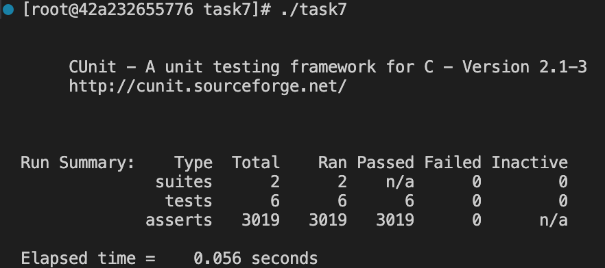
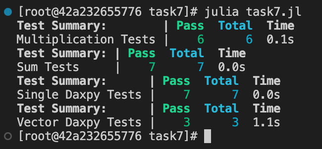

# Task 7 - Unit Testing

Codes are also available at: https://github.com/lorenzobore/ScientificComputing.

For this task I chose to performe Unit Testing on the daxpy code with both `C` and `julia`.

## C - Unit Testing

To perform Unit Testing in `C` I chose to use the **CUnit** library. First I had to download it in the Docker container with the usual command

```
dnf install CUnit
```

After this I could include the following libraries in my C code:
```
#include <CUnit/Basic.h>
#include <CUnit/CUnit.h>
```
compiling every time my `.c` codes with the command:
```
gcc task7.c -o task7 -lcunit
```


For DAXPY Unit Testing, I wrote several functions to be tested: Multiplication, Sum, Single_daxpy and Vector_daxpy. 

```
float multiplication(float a, float x){
    return a * x;
}

float sum(float b, float y){
    return b + y;
}

float single_daxpy(float a, float x, float y){
    return sum(multiplication(a,x),y); //*x + y;
}

float* vector_daxpy(float a, float* x, float* y,int N){

    float *result = (float*) malloc(N * sizeof(float)); 
    for (int i=0;i<N;i++){
        result[i] = sum(multiplication(a,x[i]),y[i]);
    }
    return result;
}
```

For each of them I also wrote a corresponding `void test_function(void)`, where I wrote some ASSERT verifications to check that the unit functions perform as expected. When running the tests, I checked all the upcoming failures and fixed the functions accordingly.


```
void test_multiplication(void)
{
    CU_ASSERT(multiplication(0,1) == 0);
    CU_ASSERT(multiplication(1,0) == 0);
    CU_ASSERT_ALMOST_EQUAL(multiplication(3.,0.1),0.3,FLT_EPSILON);
    CU_ASSERT_ALMOST_EQUAL(multiplication(-3.,0.1),-0.3,FLT_EPSILON);
}

void test_sum(void)
{
    CU_ASSERT(sum(0,1) == 1);
    CU_ASSERT(sum(-1,1) == 0);
    CU_ASSERT_ALMOST_EQUAL(sum(0.3,7.1),7.4,FLT_EPSILON);
    CU_ASSERT_ALMOST_EQUAL(sum(-0.3,-7.1),-7.4,FLT_EPSILON);
}

void test_single_daxpy(void){

    CU_ASSERT(single_daxpy(0,1,0)==0);
    CU_ASSERT(single_daxpy(1,0,0)==0);
    CU_ASSERT(single_daxpy(1,1,0)==1);
    CU_ASSERT(single_daxpy(1,1,1)==2);

    CU_ASSERT(single_daxpy(-1,1,0)==-1);
    CU_ASSERT(single_daxpy(-1,1,1)==0);

    CU_ASSERT_ALMOST_EQUAL(single_daxpy(3,0.1,7.1),7.4,FLT_EPSILON);
    CU_ASSERT_ALMOST_EQUAL(single_daxpy(-3,0.1,-7.1),-7.4,FLT_EPSILON);
}

void test_vector_daxpy(void){

    // Test with variable N
    float a=3;
    float *x = (float*) malloc(N * sizeof(float));
    float *y = (float*) malloc(N * sizeof(float));
    float *result = (float*) malloc(N * sizeof(float));

    //initialize vectors
    for (int i=0;i<N;i++){
        x[i] = 0.1;
        y[i] = 7.1;
    }

    //perform test
    int i;
    for (i=0;i<N;i++){
        result[i] = *vector_daxpy(a,x,y,N);
        CU_ASSERT_ALMOST_EQUAL(result[i],7.4, FLT_EPSILON);
    }
    CU_ASSERT(i==N);
    free(x);
    free(y);
    free(result);
}

```


Eventually in the `main()` I instantiated two different Suites and populated them with my test functions. To repeat multiple tests for the `vector_daxpy` function, I declared a global variable `int N` and added three different tests to the second Suite, in order to perform verifications with three different values of  N.


```
int main()
{
    CU_initialize_registry();
    CU_pSuite suite = CU_add_suite("AddTestSuite", 0, 0);
    CU_add_test(suite, "test of multiplication()", test_multiplication);
    CU_add_test(suite, "test of sum()", test_sum);
    CU_add_test(suite, "test of single_daxpy()", test_single_daxpy);


    CU_pSuite new_suite = CU_add_suite("ParametrizedSuite", NULL, NULL);
    N=10;
    CU_add_test(new_suite, "test of vector_daxpy(N=10)", test_vector_daxpy);
    N=100;
    CU_add_test(new_suite, "test of vector_daxpy(N=10)", test_vector_daxpy);
    N=1000;
    CU_add_test(new_suite, "test of vector_daxpy(N=10)", test_vector_daxpy);
    CU_basic_run_tests();
    CU_cleanup_registry();
    return 0;
}

```

The output reflects what is expected, after having modified the functions not to fail Unit Testing.




## Julia - Unit Testing

The Unit testing in `julia` is much simpler to implement, as the Test standard library is already available and can be used by adding:
```
using Test
```

The structure of the code is very similar to the one used in `C`. Functions to be tested are defined in a single `task7.jl` file. In this case, the `single` adn `vector` formats of the daxpy formula look the same, since there's no need to differentiate between floats and vectors

```
function multiplication(a, x)
    return a * x
end

function sum(a, b)
    return a + b
end

function single_daxpy(a,x,y)
    return sum(multiplication(a,x),y)
end

function vector_daxpy(a,x,y)
    return sum(multiplication(a,x),y)
end

```


Tests are performed by using a simple `@test` wrapper around the called function. Different tests can be gathered in different `@testset`:

```
@testset "Multiplication Tests" begin
    @test multiplication(2, 3) == 6
    @test multiplication(0, 0) == 0
    @test multiplication(0, 1) == 0
    @test multiplication(1,0) == 0
    @test isapprox(multiplication(3, 0.1), 0.3)
    @test isapprox(multiplication(3, -0.1),-0.3)
end


@testset "Sum Tests" begin
    @test sum(2, 3) == 5
    @test sum(0, 0) == 0
    @test sum(2, -3) == -1
    @test sum(1,-1) == 0
    @test isapprox(sum(0.3,7.1),7.4)
    @test isapprox(sum(-0.3,7.1),6.8)
    @test isapprox(sum(-0.3,-7.1),-7.4)
end


@testset "Single Daxpy Tests" begin
    @test single_daxpy(1,0,1) == 1
    @test single_daxpy(0,0,0) == 0
    @test single_daxpy(-1,1,1) == 0
    @test single_daxpy(-1,1,0) == -1
    @test isapprox(single_daxpy(3,0.1,7.1),7.4)
    @test isapprox(single_daxpy(-3,0.1,7.1),6.8)
    @test isapprox(single_daxpy(-3,0.1,-7.1),-7.4)
end


@testset "Vector Daxpy Tests" begin
    a=3; N=10;
    x=fill(0.1,N); y=fill(7.1,N);
    
    @test isapprox(vector_daxpy(a,x,y),fill(7.4,N))
    @test isapprox(vector_daxpy(-a,x,y),fill(6.8,N))
    @test isapprox(vector_daxpy(-a,x,-y),fill(-7.4,N))
end
```


Also in this case, the output reflects what expected:
