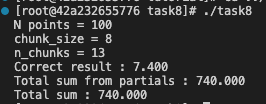

# Task 8 - Split The Work

Codes are also available at: https://github.com/lorenzobore/ScientificComputing.

## C - Split The Work

To implement the daxpy code in C, I allocate the memory for the different variables and initialize them as follows:
```
// Allocate memory for variables
int N=100;
int chunk_size=8;
float a=3;
float *x = (float*) malloc(N * sizeof(float));
float *y = (float*) malloc(N * sizeof(float));
float *result = (float*) malloc(N * sizeof(float));

//Initialize data
for (int i=0;i<N;i++){
    x[i] = 0.1;
    y[i] = 7.1;
}
```


Then, after setting the size of each chunk, I compute the number of necessary chunks using the `ceil()` function available in `<math.h>`.

```
// Calculate number of chunks
    int n_chunks = (int)ceil((double)N/chunk_size);
    int flat_idx=0;
    printf("N points = %d\n",N);
    printf("chunk_size = %d\n",chunk_size);
    printf("n_chunks = %d\n",n_chunks);
```

To split the work, I first iterate over the chunks (`0:n_chunks`) and then over the elements inside each chunk (`0:chunk_size`). The index of the flat vectors can be easily calculated as `flat_idx = chunk_size*chunk_iddx + elem_idx`. For the last chunk, since it will have less elements that the others, I exit the loops when the stopping condition `flat_idx==N` is verified.

```
//Iterate over different chunks
for (int chunk_idx=0;chunk_idx<n_chunks;chunk_idx++){
    //Iterate over elements inside chunks
    float batch_sum = 0;
    for (int elem_idx=0;elem_idx<chunk_size;elem_idx++){
        flat_idx = chunk_size*chunk_idx + elem_idx;
        if (flat_idx==N){
            break;
        }
        result[flat_idx] = a * x[flat_idx] + y[flat_idx];
        batch_sum += result[flat_idx];
    }
    chunk_sums[chunk_idx] = batch_sum;
}
```

When iterating over chunks and elements, I compute partial sums and store them in the array `chunk_sums`.

Eventually, I sum over all the N elements and check that the results and the sum values correspond.

```
//Sum over partial sums
    float total_from_partial = 0;
    for (int i=0;i<n_chunks;i++){
        total_from_partial += chunk_sums[i];
    }

    //Check the correctness of the result
    float total_sum = 0;
    for (int i=0;i<N;i++){
        bool check = assert_almost_equal(result[i],7.4,2*FLT_EPSILON);
        if (!check){
            printf("Wrong result! %.4f\n",result[i]);
        }
        total_sum += result[i];
    }

    //
    printf("Correct result : %.3f\n",result[0]);
    printf("Total sum from partials : %.3f\n",total_from_partial);
    printf("Total sum : %.3f\n",total_sum);

```

The final output is the following:


