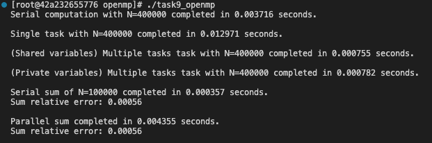
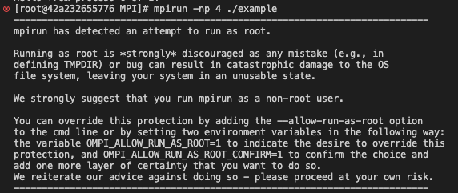
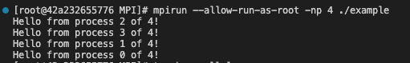
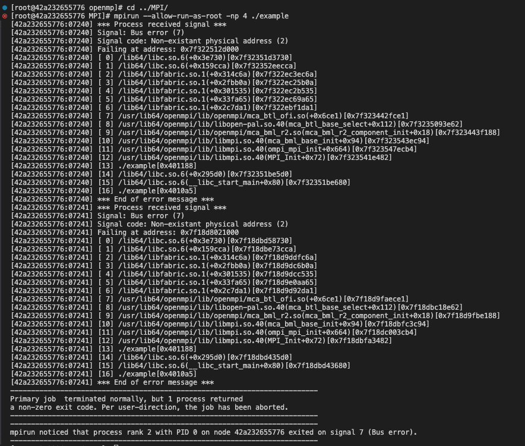

# Task 9 - Parallelization with CPU

Codes are also available at: https://github.com/lorenzobore/ScientificComputing.


## 1) - daxpy with openmp

To parallelelize the daxpy code within the CPU, I decided to compute it with 4 different approaches of parallelization, in order to check the timing of the computations. After every calculation, I check the correctness of the results and reset them with the following functions:

```
void check_result(int N,float * result,float true_result,float eps){
    for (int i=0;i<N;i++){
        bool check = abs(result[i]-true_result)<eps;
        if (!check){
            printf("Wrong result: %.4f",result[i]);
        }
    }
}

void reset_results(int N,float * result){
    for (int i=0;i<N;i++){
        result[i]=0;
    }
}
```

### Serial computation

```
//Serial computation
double start_time_serial = omp_get_wtime();
for (int i=0; i<N;i++){
    result[i] = a*x[i] + y[i];
}
double end_time_serial = omp_get_wtime();
printf("Serial computation with N=%d completed in %f seconds.\n\n", N,end_time_serial - start_time_serial);

//Check and reset results
check_result(N,result,true_result,FLT_EPSILON);
reset_results(N,x,y,result);
```

### Parallel computation - single section
```
// Setup number of threads
int n_threads = 4;
omp_set_num_threads(n_threads); // Ensure enough threads for tasks

// Single Task
double start_time = omp_get_wtime();
#pragma omp parallel
{
    int thread_id = omp_get_thread_num();
    int num_threads = omp_get_num_threads();
    #pragma omp for
    for (int i=0; i<N;i++){
        result[i] = a*x[i] + y[i];
    }
    //printf("Using thread %d of %d\n", thread_id, num_threads);
    
} 
double end_time = omp_get_wtime();
printf("Single task with N=%d completed in %f seconds.\n\n", N,end_time - start_time);

//Check and reset results
check_result(N,result,true_result,FLT_EPSILON);
reset_results(N,x,y,result);
```


### Parallel computation - Multiple sections, shared variables

```
// Multiple Tasks
double start_time0 = omp_get_wtime();
#pragma omp parallel
{
    int thread_id = omp_get_thread_num();
    int num_threads = omp_get_num_threads();

    #pragma omp sections
    {
        #pragma omp section
        {
            for (int i=0; i<100000;i++){
                result[i] = a*x[i] + y[i];
            }
            //printf("Using thread %d of %d\n", thread_id, num_threads);
        }

        #pragma omp section
        {
            for (int i=100000; i<200000;i++){
                result[i] = a*x[i] + y[i];
            }
            //printf("Using thread %d of %d\n", thread_id, num_threads);
        }

        #pragma omp section
        {
            for (int i=200000; i<300000;i++){
                result[i] = a*x[i] + y[i];
            }
            //printf("Using thread %d of %d\n", thread_id, num_threads);
        }

        #pragma omp section
        {
            for (int i=300000; i<400000;i++){
                result[i] = a*x[i] + y[i];
            }
            //printf("Using thread %d of %d\n", thread_id, num_threads);
        }
    } 
} 
double end_time0 = omp_get_wtime();
printf("(Shared variables) Multiple tasks task with N=400000 completed in %f seconds.\n\n",end_time0 - start_time0);

//Check and reset results
check_result(N,result,true_result,FLT_EPSILON);
reset_results(N,x,y,result);

```

### Parallel computation - multiple sections, private variables

```
// Multiple Tasks
double start_time1 = omp_get_wtime();
int private_thr_id;
int private_tot_threads;

#pragma omp parallel default(none) \
                        private(private_thr_id,private_tot_threads)\
                        firstprivate(a,x,y,result)
{
    int thread_id = omp_get_thread_num();
    int num_threads = omp_get_num_threads();

    private_thr_id=thread_id;
    private_tot_threads=num_threads;

    #pragma omp sections
    {
        #pragma omp section
        {
            for (int i=0; i<100000;i++){
                result[i] = a*x[i] + y[i];
            }
            //printf("Using thread %d of %d\n", private_thr_id, private_tot_threads);
        }

        #pragma omp section
        {
            for (int i=100000; i<200000;i++){
                result[i] = a*x[i] + y[i];
            }
            //printf("Using thread %d of %d\n", private_thr_id, private_tot_threads);
        }

        #pragma omp section
        {
            for (int i=200000; i<300000;i++){
                result[i] = a*x[i] + y[i];
            }
            //printf("Using thread %d of %d\n", private_thr_id, private_tot_threads);
        }

        #pragma omp section
        {
            for (int i=300000; i<400000;i++){
                result[i] = a*x[i] + y[i];
            }
            //printf("Using thread %d of %d\n", private_thr_id, private_tot_threads);
        }
    } 
} 
double end_time1 = omp_get_wtime();
printf("(Private variables) Multiple tasks task with N=400000 completed in %f seconds.\n\n",end_time1 - start_time1);

//Check and reset results
check_result(N,result,true_result,FLT_EPSILON);
reset_results(N,x,y,result);
```

### (Optional) Reduce result vector

```
//Sum of the final vector
    int N1=100000;

    //Serial sum
    float sum = 0;
    double start_time_serial3 = omp_get_wtime();
    for (int i=0; i<N1;i++){
        result[i] = a*x[i] + y[i];
    }
    sum = addition(N1, result);
    double end_time_serial3 = omp_get_wtime();
    printf("Serial sum of N=%d completed in %f seconds.\n", N1, end_time_serial3 - start_time_serial3);
    printf("Sum relative error: %.5f\n\n",abs(sum-7.4*N1)/sum);

    // Multiple Tasks
    int i=0;
    float sum1 = 0;
    double start_time4 = omp_get_wtime();
    #pragma omp parallel 
    {
        #pragma omp for
        for (int i=0; i<N1;i++){
            result[i] = a*x[i] + y[i];
        }

        #pragma omp for reduction(+:sum1)
        for (int i=0;i<N;i++){
            sum1+=result[i];
        }
    } 
    double end_time4 = omp_get_wtime();
    printf("Parallel sum completed in %f seconds.\n",end_time4 - start_time4);
    printf("Sum relative error: %.5f \n\n",abs(sum1-7.4*N1)/sum1);

    free(x);
    free(y);
    free(result);

```


### Output

These results should be statistically validated, therefore they are not enough to make generic assumptions. The serial computation happens to be faster than the parallel one with a single task counting 400k points. An improvement is seen in the parallel computation when the 400k points are splitted in 4 parallel tasks, treating 100k points each. No additional improvement seems to appear when the variables are no longer shared by the threads but they own their private copies. But again, this should be further verified, as it might depend on N and/or on the CPU.



The same happens for the computation of the sum of the final reuslt vector. The serial approach happens to be systematically faster than the parallel one,  while both retrieving the correct final sum result.


## 2) daxpy with MPI

Before trying to write the daxpy code I ran the codes available on the tutorial.

```
#include <mpi.h>
#include <stdio.h>

//export PATH=/usr/lib64/openmpi/bin:$PATH

int main(int argc, char** argv) {
MPI_Init(&argc, &argv); // Initialize MPI

int world_rank;
MPI_Comm_rank(MPI_COMM_WORLD, &world_rank); // Get the rank of the process

int world_size;
MPI_Comm_size(MPI_COMM_WORLD, &world_size); // Get the total number of processes

printf("Hello from process %d of %d!\n", world_rank, world_size);

MPI_Finalize(); // Finalize MPI
return 0;
}
```

When trying to execute the "Hello World!", compiled with `mpicc -o example example.c` and ran with `mpirun -np 4 ./example` as suggested by the tutorial, I received the following error:



I did not understand the nature of the error but I added the flag `--allow-run-as-root`, managing to obtain the output:



Nonetheless, all my following attempts to run the "Parallel_sum" code and the "daxpy codes" ended up reporting the same Bus Error.





```
#include <mpi.h>
#include <stdio.h>
#include <stdlib.h>
#include <time.h>


//Broken code does not run correctly
int main(int argc, char** argv) {
    MPI_Init(&argc, &argv);

    int world_rank, world_size;
    MPI_Comm_rank(MPI_COMM_WORLD, &world_rank);
    MPI_Comm_size(MPI_COMM_WORLD, &world_size);

    // Each process creates a local sum
    srand(time(NULL) + world_rank); // Seed random number generator differently for each process
    double local_value = (double)rand() / RAND_MAX * 100.0; // Example local value
    double global_sum;

    printf("Process %d has local value: %f\n", world_rank, local_value);

    // Reduce all local_value's into global_sum on process 0
    // MPI_SUM is the operation to perform
    MPI_Reduce(&local_value, &global_sum, 1, MPI_DOUBLE, MPI_SUM, 0, MPI_COMM_WORLD);

    // Process 0 prints the global sum
    if (world_rank == 0) {
        printf("Total sum computed on process 0: %f\n", global_sum);
    }

    MPI_Finalize();
    return 0;
}

```

```
#include <mpi.h>
#include <stdio.h>
#include <stdlib.h>

int main(int argc, char** argv) {
    int rank, size;
    const int N = 8; 
    float a = 3.0f;  // Scalar multiplier

    float *x = NULL, *y = NULL, *dd = NULL;
    float *local_x, *local_y, *local_dd;
    int chunk;

    MPI_Init(&argc, &argv);
    MPI_Comm_rank(MPI_COMM_WORLD, &rank);
    MPI_Comm_size(MPI_COMM_WORLD, &size);

    if (N % size != 0) {
        if (rank == 0) {
            printf("Vector size %d must be divisible by number of processes %d\n", N, size);
        }
        MPI_Finalize();
        return 1;
    }

    chunk = N / size;

    // Allocate local chunks
    local_x = (float*)malloc(chunk * sizeof(float));
    local_y = (float*)malloc(chunk * sizeof(float));
    local_dd = (float*)malloc(chunk * sizeof(float));

    // Root process initializes full vectors
    if (rank == 0) {
        x = (float*)malloc(N * sizeof(float));
        y = (float*)malloc(N * sizeof(float));
        dd = (float*)malloc(N * sizeof(float));

        for (int i = 0; i < N; i++) {
            x[i] = i * 1.0f;
            y[i] = i * 2.0f;
        }
    }

    // Scatter vectors x and y to all processes
    MPI_Scatter(x, chunk, MPI_FLOAT, local_x, chunk, MPI_FLOAT, 0, MPI_COMM_WORLD);
    MPI_Scatter(y, chunk, MPI_FLOAT, local_y, chunk, MPI_FLOAT, 0, MPI_COMM_WORLD);

    // Perform computation: dd = a*x + y
    for (int i = 0; i < chunk; i++) {
        local_dd[i] = a * local_x[i] + local_y[i];
    }

    // Gather the result
    MPI_Gather(local_dd, chunk, MPI_FLOAT, dd, chunk, MPI_FLOAT, 0, MPI_COMM_WORLD);

    // Root process prints the result
    if (rank == 0) {
        printf("Result vector dd = a*x + y:\n");
        for (int i = 0; i < N; i++) {
            printf("%.2f ", dd[i]);
        }
        printf("\n");
        free(x);
        free(y);
        free(dd);
    }

    free(local_x);
    free(local_y);
    free(local_dd);

    MPI_Finalize();
    return 0;
}

```


